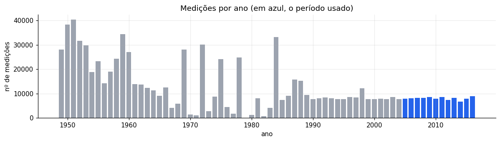
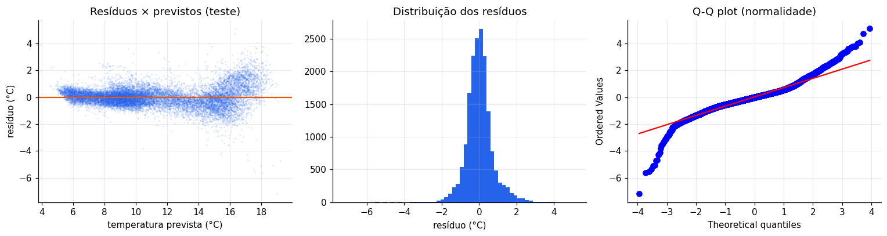
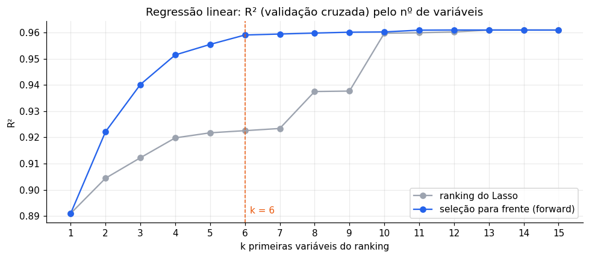

# Previsão da temperatura da água do mar

**Atividade de Machine Learning** · Regressão · Dataset [CalCOFI](https://www.kaggle.com/datasets/sohier/calcofi) (Kaggle) · Notebook: [temperatura_calcofi.ipynb](temperatura_calcofi.ipynb)

> **Resultado.** Um Gradient Boosting com **6 variáveis** prevê a temperatura da água com **R² = 0,990** (R² ajustado = 0,990) em estações que nunca viu, errando em média **0,22 °C**. Treinado só com 2005–2013, mantém **R² = 0,982** em 2014–2016.

| | |
|---|---|
| **Pergunta da base** | Dá para prever a temperatura da água a partir da salinidade? |
| **Pergunta ampliada** | Quais medições permitem prever a temperatura, e qual modelo faz isso melhor? |
| **Dados** | 864.863 medições (1949–2016) → recorte 2005–2016 → 88.165 após a limpeza |
| **Modelos testados** | 14 (baseline, 7 lineares, 6 não lineares) |
| **Modelo final** | Gradient Boosting com 6 variáveis e hiperparâmetros ajustados |
| **Critério de escolha** | R² da validação cruzada + parcimônia (tolerância de 0,005) |

## Sumário

1. [A ideia central](#1-a-ideia-central)
2. [Dados e limpeza](#2-dados-e-limpeza)
3. [Como avaliamos](#3-como-avaliamos)
4. [Parte A — Modelos lineares](#4-parte-a--modelos-lineares)
5. [Parte B — Modelos não lineares](#5-parte-b--modelos-não-lineares)
6. [Ferramentas testadas: o que ficou e o que saiu](#6-ferramentas-testadas-o-que-ficou-e-o-que-saiu)
7. [Modelo final](#7-modelo-final)
8. [Limitações](#8-limitações)
9. [Como executar](#9-como-executar)

## 1. A ideia central

O oceano é organizado em **camadas**, e cada camada tem uma "assinatura química":

| Camada | Temperatura | Oxigênio | Nutrientes (nitrato, fosfato, silicato) | Salinidade |
|---|---|---|---|---|
| Superfície | Quente | Alto (contato com o ar, algas) | Baixos (as algas consomem) | Menor |
| Fundo | Fria | Baixo | Altos (sem luz, ninguém consome) | Maior |

A salinidade sozinha explica **63%** da temperatura. Nutrientes, oxigênio e profundidade identificam a camada da água, e o modelo linear chega a **96%**. Como a temperatura cai em curva com a profundidade (a *termoclina*), um modelo não linear chega a **99%**.


## 2. Dados e limpeza

O CalCOFI tem dois arquivos ligados por `Cst_Cnt`: `bottle.csv` (uma linha por medição em cada profundidade) e `cast.csv` (uma linha por estação, com data e posição).

**Recorte 2005–2016.** Usamos **todas** as medições do período, o que é uma decisão de escopo e não uma amostra aleatória. Antes de 2005, só 31% das linhas têm nutrientes; depois, 92%.



**Colunas: de 80 para 13.** Saíram identificadores, colunas de qualidade e precisão, cópias `R_…`, colunas com 30% ou mais de ausentes e **9 colunas com vazamento de dados**, calculadas a partir da própria temperatura (densidade, temperatura potencial, saturação de oxigênio…). Com a densidade, o R² iria de 0,70 para 0,999: o modelo só "desfaria a conta".

**Linhas.**

| Etapa | Medições restantes |
|---|---|
| Recorte 2005–2016 | 96.655 |
| Remoção de duplicatas | 96.634 |
| Remoção de ausentes | 88.773 |
| Remoção de valores fisicamente impossíveis | 88.772 |
| Remoção de outliers (percentis 0,1% e 99,9%), com limites calculados **só no treino** | 70.700 treino + 17.465 teste |

**Engenharia de atributos.** Criamos `log_prof` (log da profundidade, para endireitar a termoclina) e `mes_sin`/`mes_cos` (o mês é cíclico). O conjunto completo ficou com 15 variáveis.

## 3. Como avaliamos

- **R²** (fração da variação explicada) e **R² ajustado**, que penaliza variáveis extras e permite comparar modelos com 1 a 135 variáveis:

$$R^2_{aj} = 1 - (1 - R^2)\,\frac{n - 1}{n - p - 1}$$

- **Divisão por estação** (`GroupShuffleSplit`, 80/20): medições vizinhas da mesma estação são quase iguais (Durbin-Watson = 0,37). Nenhuma estação aparece no treino e no teste ao mesmo tempo.
- **Validação cruzada de 5 partes por estação** (`GroupKFold`).
- **Critério de escolha, definido antes de modelar:** o maior R² da validação cruzada; entre modelos a no máximo 0,005 do melhor, o mais simples.

## 4. Parte A — Modelos lineares

| Modelo | R² teste | MAE (°C) | O que mostra |
|---|---|---|---|
| 0. Baseline (média) | 0,000 | 3,05 | A referência mínima |
| 1. Linear: salinidade | 0,633 | 1,58 | Responde à pergunta da base: ajuda, mas não basta |
| 2. + profundidade | 0,731 | 1,44 | Teste F parcial: p ≈ 0 |
| 3. 13 variáveis originais | 0,958 | 0,53 | Multicolinearidade inverte sinais (salinidade: −7,17 → +1,88) |
| 4. 15 variáveis (engenharia) | 0,962 | 0,50 | Log e mês cíclico: ganho pequeno |
| 5. Ridge / Lasso | 0,962 | 0,50 | Sem ganho (n ≫ p, sem overfitting) |
| 6. Polinomial grau 2 (135 termos) | 0,985 | 0,27 | Prova a não linearidade, mas não é interpretável |
| 7. Linear reduzida (6) | 0,959 | 0,51 | Seleção para frente |

**Pressupostos (Modelo 4):** Breusch-Pagan p ≈ 0 (heterocedasticidade), Jarque-Bera p ≈ 0 (resíduos não normais), Durbin-Watson 0,37 (autocorrelação). As previsões continuam válidas, mas os p-valores são otimistas. É mais um sinal de que a relação não é linear.



**Seleção de variáveis.** Comparamos o ranking do caminho do Lasso com a seleção sequencial para frente. A seleção para frente venceu (R² 0,959 contra 0,923 com 6 variáveis), porque o Lasso é instável com variáveis muito correlacionadas.



## 5. Parte B — Modelos não lineares

| Modelo | R² treino | R² validação cruzada | R² teste | MAE (°C) |
|---|---|---|---|---|
| 8. KNN (10 vizinhos) | 0,989 | 0,980 | 0,981 | 0,34 |
| 9. Random Forest | 0,999 | 0,992 | 0,993 | 0,18 |
| 10. Gradient Boosting (15) | 0,994 | 0,9925 | 0,993 | 0,20 |
| 11. Gradient Boosting (6) | 0,990 | 0,988 | 0,989 | 0,24 |
| **12. Gradient Boosting ajustado (6)** | **0,995** | **0,989** | **0,990** | **0,22** |

**Seleção para o Gradient Boosting.** Fizemos o ranking com o próprio modelo (importância por permutação numa validação interna do treino). A curva achata a partir de 6 variáveis.


**Ajuste de hiperparâmetros.** Busca em grade com 8 combinações e validação cruzada por estação. A melhor foi `learning_rate=0.05`, `max_iter=800`, `max_leaf_nodes=63`. O ganho foi pequeno (+0,001): o modelo é pouco sensível aos hiperparâmetros.


## 6. Ferramentas testadas: o que ficou e o que saiu

| Ferramenta | Resultado | Decisão |
|---|---|---|
| Regressão linear (OLS) | até 0,962 | Mantida como modelo interpretável |
| Engenharia de atributos | +0,004 | Mantida |
| Ridge e Lasso | = linear | Descartados: não havia overfitting para corrigir |
| Polinomial grau 2 | 0,985 | Referência: prova a não linearidade |
| Lasso como selecionador | 0,923 (6 variáveis) | Descartado: instável com multicolinearidade |
| Seleção para frente | 0,959 (6 variáveis) | Mantida |
| KNN | 0,981 | Descartado: abaixo das árvores e lento |
| Random Forest | 0,993 | Descartado: memoriza o treino (0,999) e é mais pesado |
| Gradient Boosting | 0,993 | Mantido |
| Importância por permutação | 6 variáveis | Mantida |
| Busca em grade | +0,001 | Mantida |

## 7. Modelo final

**Gradient Boosting (`HistGradientBoostingRegressor`) com 6 variáveis:** nitrato, silicato, oxigênio, profundidade, mês (seno) e fosfato.

| R² validação cruzada | R² teste | R² ajustado | MAE | RMSE | R² 2014–2016 |
|---|---|---|---|---|---|
| 0,989 | 0,990 | 0,990 | 0,22 °C | 0,37 °C | 0,982 |

**Por que este modelo:** o melhor R² de validação cruzada foi o do Gradient Boosting com 15 variáveis (0,9925). O modelo final fica a só 0,0034 dele, usando 6 variáveis em vez de 15. Pela parcimônia, ficamos com o mais simples. O custo é de apenas 0,02 °C de erro médio.


O erro é maior na superfície (0–50 m: 0,39 °C), onde sol, vento e estação variam, e menor no fundo (menos de 0,08 °C abaixo de 200 m).


## 8. Limitações

- Vale para a costa da Califórnia em 2005–2016.
- Os nutrientes exigem laboratório: o modelo serve mais para completar dados faltantes ou detectar medições suspeitas do que para substituir o termômetro.
- A busca de hiperparâmetros foi pequena (8 combinações), e a tolerância de 0,005 da parcimônia é uma escolha nossa.
- Os p-valores dos modelos lineares são otimistas (resíduos heterocedásticos, não normais e autocorrelacionados).

## 9. Como executar

```bash
python -m venv .venv
source .venv/bin/activate        # Windows: .venv\Scripts\activate
pip install -r requirements.txt
jupyter notebook temperatura_calcofi.ipynb
```

Os arquivos são baixados automaticamente do Kaggle (`kagglehub`) para `data/` na primeira execução. A execução completa leva cerca de 9 minutos (a Random Forest e a busca de hiperparâmetros são as etapas mais lentas).
