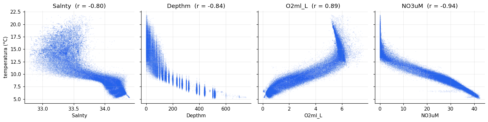
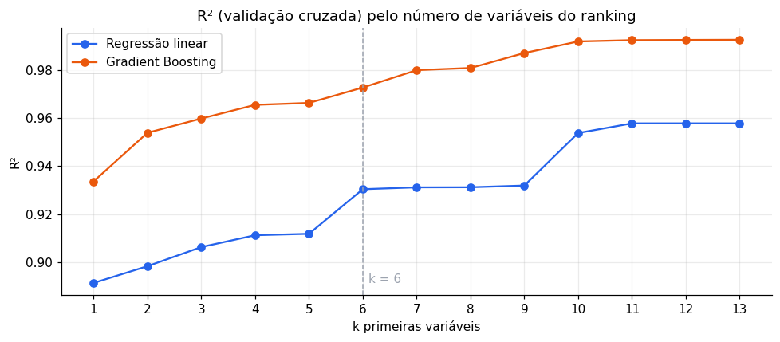
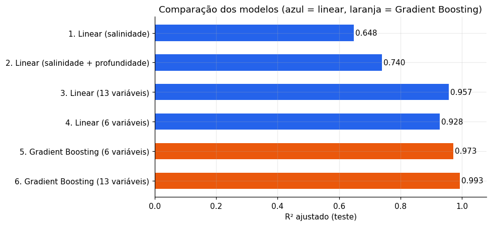
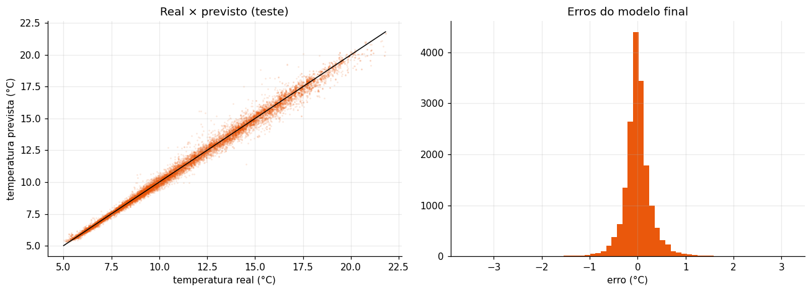
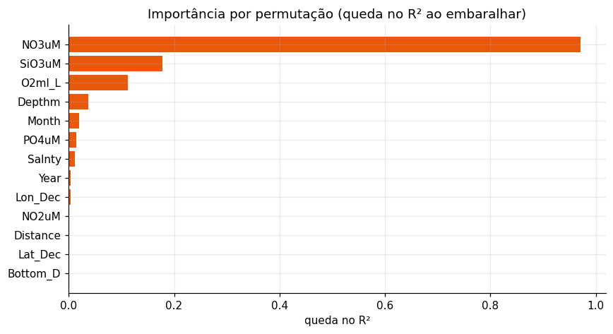

# Previsão da temperatura da água do mar

**Atividade de Machine Learning** · Regressão · Dataset [CalCOFI](https://www.kaggle.com/datasets/sohier/calcofi) (Kaggle) · Notebook: [temperatura_calcofi.ipynb](temperatura_calcofi.ipynb)

> **Resultado.** Um modelo de Gradient Boosting com 13 variáveis prevê a temperatura da água com **R² = 0,993** e **R² ajustado = 0,993** em estações que ele nunca viu, errando em média **0,20 °C**. Treinado só com 2005–2013, mantém **R² = 0,980** nos anos de 2014–2016.

| | |
|---|---|
| **Problema** | Prever a temperatura da água (`T_degC`) |
| **Pergunta da base** | Dá para prever a temperatura a partir da salinidade? |
| **Dados** | 864.863 medições (1949–2016); recorte 2005–2016: 96.655; após a limpeza: 88.143 |
| **Modelos testados** | 6, do mais simples ao mais completo |
| **Modelo final** | Gradient Boosting com 13 variáveis |
| **Métrica principal** | R² ajustado no conjunto de teste |

## Sumário

1. [A ideia central](#1-a-ideia-central)
2. [Os dados](#2-os-dados)
3. [Preparação dos dados](#3-preparação-dos-dados)
4. [Os modelos, passo a passo](#4-os-modelos-passo-a-passo)
5. [Comparação](#5-comparação)
6. [Teste de robustez](#6-teste-de-robustez)
7. [Modelo final](#7-modelo-final)
8. [Limitações](#8-limitações)
9. [Como executar](#9-como-executar)

## 1. A ideia central

O oceano é organizado em **camadas**. A superfície é aquecida pelo sol; abaixo de ~200 m a água é fria e quase não muda. Cada camada tem uma "assinatura química" própria:

| Camada | Temperatura | Oxigênio | Nutrientes (nitrato, fosfato…) | Salinidade |
|---|---|---|---|---|
| Superfície | Quente | Alto (contato com o ar, algas) | Baixos (as algas consomem) | Menor |
| Fundo | Fria | Baixo | Altos (ninguém consome) | Maior |

1. A salinidade sozinha explica só **65%** da temperatura.
2. Profundidade, oxigênio e nutrientes "denunciam" de que camada a água veio: o modelo linear chega a **95,7%**.
3. A relação com a profundidade é **curva** (termoclina), então um modelo não linear chega a **99,3%**.

## 2. Os dados

O CalCOFI mede o oceano na costa da Califórnia desde 1949. São dois arquivos ligados pela coluna `Cst_Cnt`:

| Arquivo | Uma linha é… | Exemplos de colunas |
|---|---|---|
| `bottle.csv` (864 mil linhas, 74 colunas) | uma medição numa profundidade | `T_degC`, `Salnty`, `Depthm`, `O2ml_L`, `NO3uM` |
| `cast.csv` (34 mil linhas, 61 colunas) | uma parada do navio (estação) | `Year`, `Month`, `Lat_Dec`, `Lon_Dec`, `Bottom_D` |

### Recorte 2005–2016

Usamos **todas** as medições de 2005 a 2016 (não é amostra aleatória), por três motivos:

- **Dados completos:** antes de 2005 só 31% das linhas têm os nutrientes medidos; depois, 92%.
- **Coerência:** o oceano esquentou e os instrumentos mudaram em 70 anos.
- **Tamanho:** ~97 mil medições, e o notebook roda em cerca de 1 minuto.



## 3. Preparação dos dados

### Colunas: de 80 para 13

| Removidas | Motivo |
|---|---|
| Identificadores (`Btl_Cnt`, `Sta_ID`…) | Códigos sem significado físico |
| Qualidade e precisão (`T_qual`, `S_prec`…) | Descrevem a medição, não a água |
| Cópias `R_…` e colunas com 30% ou mais de ausentes | Repetidas, ou obrigariam a descartar 1/3 das linhas |
| **Vazamento:** `R_TEMP`, `R_POTEMP`, `STheta`, `R_SIGMA`, `R_SVA`, `R_DYNHT`, `O2Sat`, `R_O2Sat`, `Oxy_µmol/Kg` | São **calculadas a partir da temperatura**. Com `STheta`, o R² salta de 0,70 para 0,999: o modelo apenas "desfaz a conta" |

Ficaram **13 preditoras**: salinidade, profundidade, oxigênio, 4 nutrientes (`PO4uM`, `SiO3uM`, `NO3uM`, `NO2uM`), latitude, longitude, profundidade do fundo, distância da costa, mês e ano.

### Linhas

| Etapa | Medições restantes |
|---|---|
| Recorte 2005–2016 | 96.655 |
| Remoção de duplicatas | 96.634 |
| Remoção de valores ausentes | 88.773 |
| Remoção de outliers (fora dos percentis 0,1% e 99,9%) | **88.143** |

### Divisão por estação

- 80% treino (70.542) e 20% teste (17.601), com `random_state=42`.
- **Por estação** (`GroupShuffleSplit`): medições da mesma estação em profundidades vizinhas são quase iguais. Se ficassem em lados opostos, o modelo "colaria" e o R² ficaria inflado.
- Validação cruzada de 5 partes (`GroupKFold`), também por estação.

### Métrica

O **R²** mede a fração da variação explicada. O **R² ajustado** penaliza variáveis extras e é usado para comparar modelos com números diferentes de variáveis:

$$R^2_{aj} = 1 - (1 - R^2)\,\frac{n - 1}{n - p - 1}$$

## 4. Os modelos, passo a passo

| Passo | Modelo | Variáveis | Pergunta |
|---|---|---|---|
| 1 | Regressão linear | 1 | A salinidade prevê a temperatura? |
| 2 | Regressão linear | 2 | Quanto a profundidade acrescenta? |
| 3 | Regressão linear | 13 | Até onde vai um modelo linear com tudo? |
| — | Seleção (Lasso) | 13 → ranking | Quais variáveis importam? |
| 4 | Regressão linear reduzida | 6 | Dá para simplificar? |
| 5 | Gradient Boosting reduzido | 6 | Um modelo não linear faz melhor? |
| 6 | Gradient Boosting | 13 | Qual o teto destes dados? |

**Modelo 1 (salinidade):** R² = 0,648. A salinidade ajuda (p ≈ 0), mas sobra muita variação. Coeficiente: −7,15 °C por unidade (água salgada = água funda = fria).

**Modelo 2 (+ profundidade):** R² = 0,740.

**Modelo 3 (13 variáveis):** R² = 0,957, MAE = 0,54 °C. Treino, validação cruzada e teste iguais: sem overfitting. Mas a **multicolinearidade** (VIF até 188) inverte sinais: a salinidade passa de −7,15 para +1,85.

**Seleção com Lasso:** regressão com penalidade L1. Diminuindo a penalidade, as variáveis entram uma a uma, e essa ordem vira um ranking. O top 6 é `NO3uM`, `Month`, `NO2uM`, `Lon_Dec`, `Bottom_D` e `Salnty`. A profundidade não entra porque o nitrato já carrega a mesma informação.



**Modelo 4 (linear, 6 variáveis):** R² = 0,928.

**Modelo 5 (Gradient Boosting, 6 variáveis):** R² = 0,973. Com as mesmas variáveis, o modelo não linear ganha 4,5 pontos.

**Modelo 6 (Gradient Boosting, 13 variáveis):** R² = 0,993, MAE = 0,20 °C.

## 5. Comparação



| Modelo | Variáveis | R² treino | R² validação cruzada | R² teste | R² ajustado teste | MAE (°C) |
|---|---|---|---|---|---|---|
| 1. Linear (salinidade) | 1 | 0,646 | 0,646 | 0,648 | 0,648 | 1,58 |
| 2. Linear (salinidade + profundidade) | 2 | 0,740 | 0,740 | 0,740 | 0,740 | 1,43 |
| 3. Linear (13 variáveis) | 13 | 0,958 | 0,958 | 0,957 | 0,957 | 0,54 |
| 4. Linear (6 variáveis) | 6 | 0,931 | 0,930 | 0,928 | 0,928 | 0,68 |
| 5. Gradient Boosting (6 variáveis) | 6 | 0,978 | 0,973 | 0,973 | 0,973 | 0,38 |
| **6. Gradient Boosting (13 variáveis)** | **13** | **0,994** | **0,993** | **0,993** | **0,993** | **0,20** |

Como n (17.601) é muito maior que p (até 13), o R² ajustado é praticamente igual ao R²: nenhum modelo está inflando o resultado com variáveis inúteis.

## 6. Teste de robustez

Para descartar vazamento, treinamos com **2005–2013** e testamos em **2014–2016**, anos que incluem o *Blob*, uma onda de calor marinha no Pacífico.

| Modelo | R² 2014–2016 | MAE (°C) |
|---|---|---|
| Regressão linear | 0,949 | 0,61 |
| Gradient Boosting | **0,980** | 0,36 |

## 7. Modelo final

**Gradient Boosting (`HistGradientBoostingRegressor`) com 13 variáveis**, hiperparâmetros padrão (100 árvores, taxa de aprendizado 0,1, até 31 folhas).

| R² treino | R² validação cruzada | R² teste | R² ajustado | MAE | RMSE |
|---|---|---|---|---|---|
| 0,994 | 0,993 ± 0,0003 | 0,993 | 0,993 | 0,20 °C | 0,31 °C |



**Variáveis mais importantes** (queda no R² ao embaralhar): nitrato (0,97), silicato (0,18), oxigênio (0,11), profundidade (0,04) e mês (0,02).



## 8. Limitações

- Vale para a costa da Califórnia em 2005–2016.
- Os nutrientes precisam ser medidos em laboratório, então o modelo serve mais para completar dados faltantes do que para substituir o termômetro.
- Os hiperparâmetros do Gradient Boosting não foram ajustados.
- O mês entra como número (dezembro e janeiro ficam "longe"); uma codificação cíclica (seno/cosseno) seria melhor.
- Os resíduos da regressão linear não são normais nem homocedásticos, então os p-valores devem ser lidos com cautela.

## 9. Como executar

```bash
python -m venv .venv
source .venv/bin/activate        # Windows: .venv\Scripts\activate
pip install -r requirements.txt
jupyter notebook temperatura_calcofi.ipynb
```

Os arquivos são baixados automaticamente do Kaggle (`kagglehub`) para `data/` na primeira execução. A execução completa leva cerca de 1 minuto.

### Estrutura

```
├── temperatura_calcofi.ipynb   # notebook com todo o trabalho
├── figuras/                    # gráficos usados no README
├── requirements.txt
└── data/                       # bottle.csv e cast.csv (baixados automaticamente, fora do git)
```
